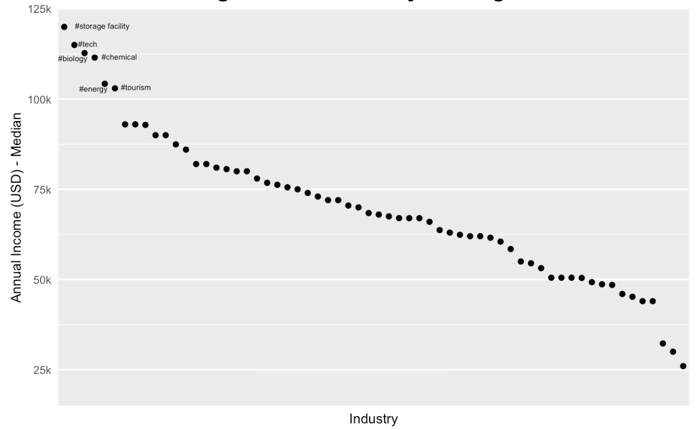
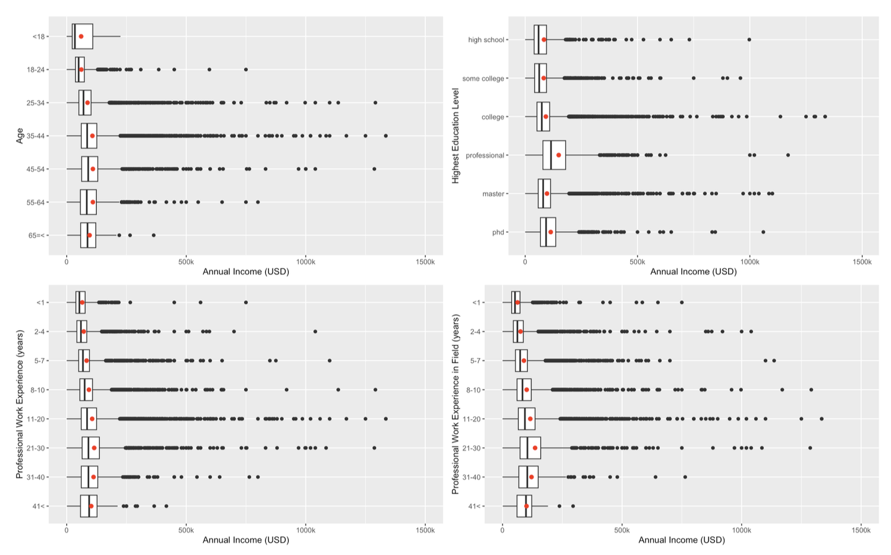
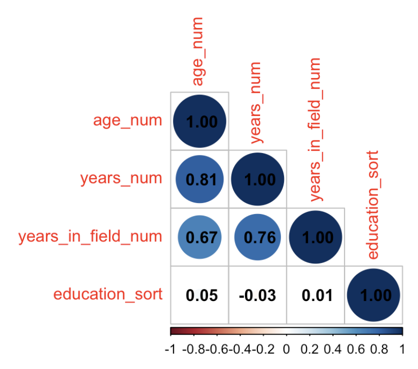
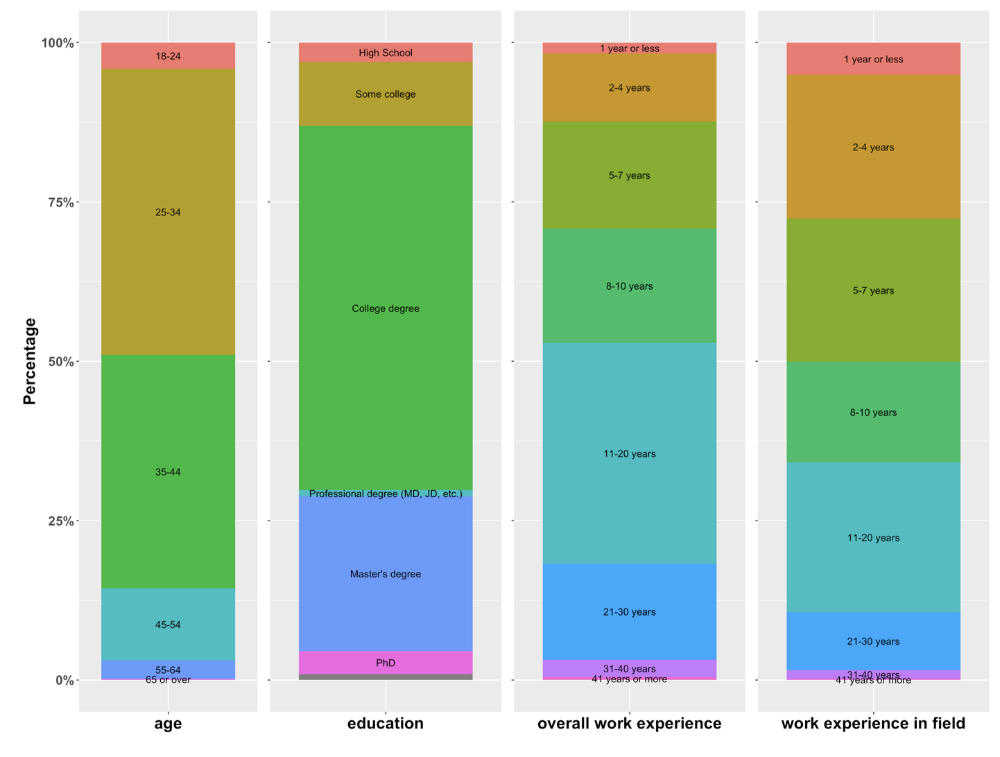

# Salary Analysis (Data Wrangling & Visualization in R)

## Overview

This project analyzes job salary data using R, focusing on data cleaning, transformation, and visualization.

The main output is a Quarto (`.qmd`) report that documents the full workflow, including data preprocessing, exploratory analysis, and interpretation of results.

---

## Objectives

The analysis aims to answer the following questions:

- Which industries tend to have higher salaries?  
- What factors (e.g., experience, education, age) influence salary levels?  
- How do these factors interact with each other?  

In addition, the project critically evaluates limitations in the data and their impact on the analysis.

---

## Methods

This project emphasizes practical data science skills in R, including:

- **Data wrangling**
  - Filtering, mutating, and summarizing data  
  - Handling different variable types  
  - Cleaning messy free-text fields using regular expressions  

- **Data cleaning**
  - Addressing inconsistencies in user-generated inputs  
  - Preparing data for analysis and visualization  

- **Data visualization**
  - Creating informative plots using `ggplot2`  
  - Communicating insights with clear figure design and captions  

- **Analytical reasoning**
  - Interpreting trends and relationships  
  - Identifying confounding factors  
  - Discussing data limitations in context  

---

## Structure

- `ask-a-manager.qmd` — Main report (Quarto document)  
- `ask-a-manager.pdf` — Rendered report output 

The report is organized into:
1. **Data Cleaning** — preprocessing steps with justification  
2. **Analysis & Visualization** — visualizations and interpretation  

---

## Data

The dataset used in this project contains job salary information with multiple free-text fields, requiring substantial cleaning and preprocessing.

To respect data usage considerations, the dataset is not included in this repository.

---

## Key Takeaways

- Real-world datasets often require significant cleaning before analysis  
- Free-text fields introduce complexity that requires careful handling  
- Visualization plays a key role in understanding relationships between variables  
- Interpretation must consider both trends and data limitations  

  

  <em>Figure 1. High Income Industry Ranking.</em>

  

  <em>Figure 2. Annual Income Distribution by Industry.</em>

  

  <em>Figure 3. Correlation Matrix among Age, Work Experience and Education.</em>

  

  <em>Figure 4. Proportions of Age / Education / Work Experience in Tech.</em>

---

## Notes

- This project was completed as part of a graduate-level data science course  
- The focus is on methodology and analytical thinking rather than specific results  

---