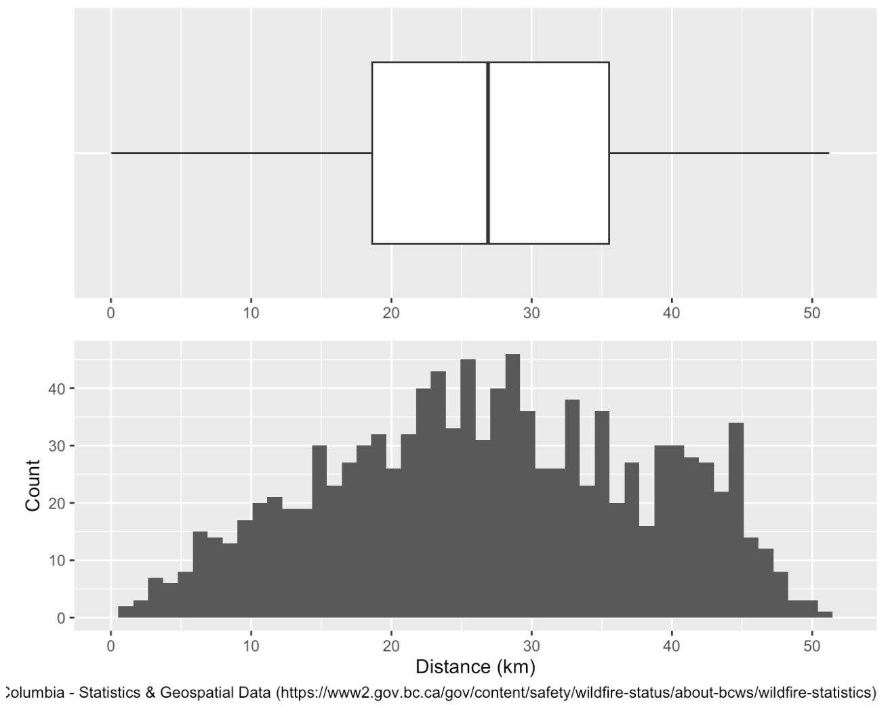
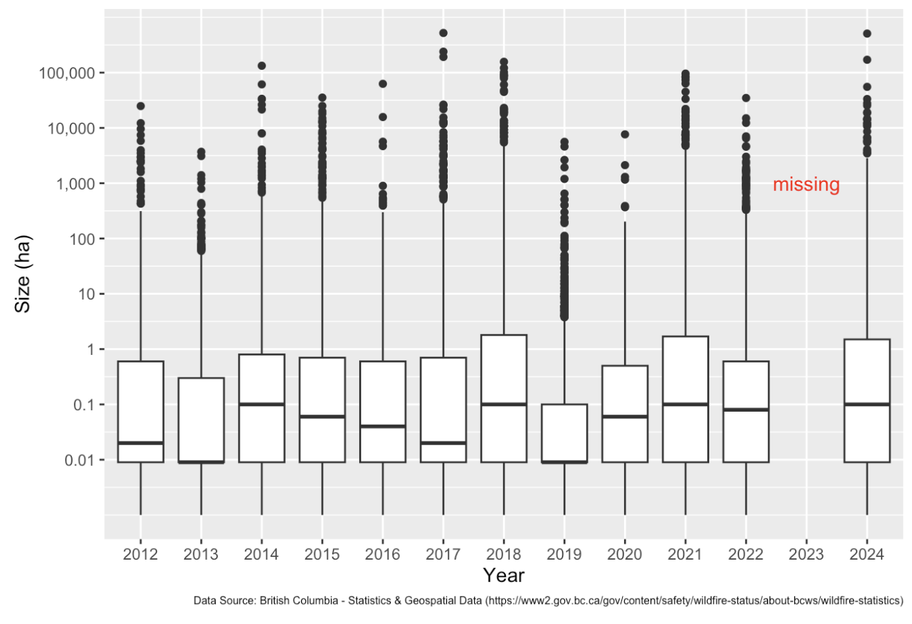
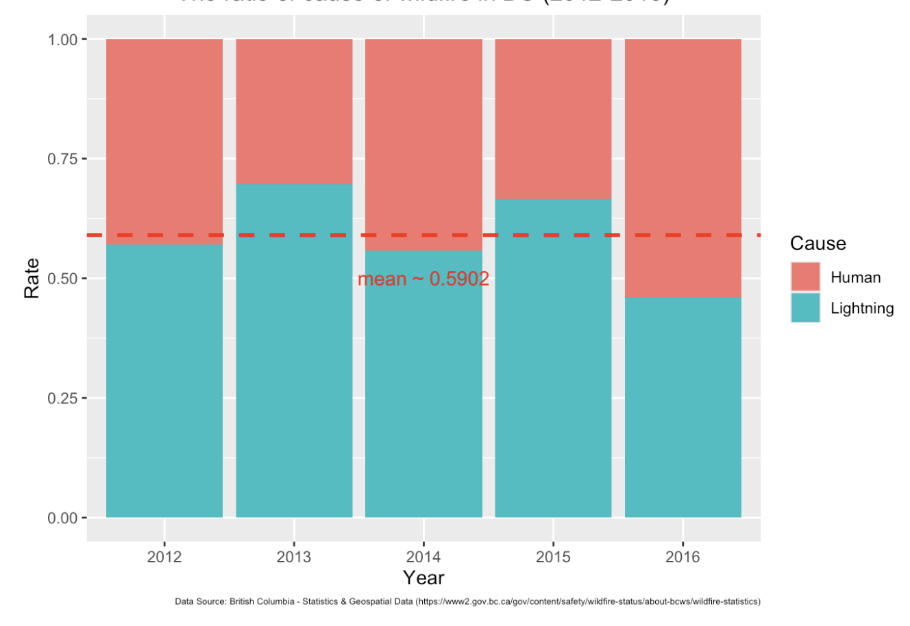
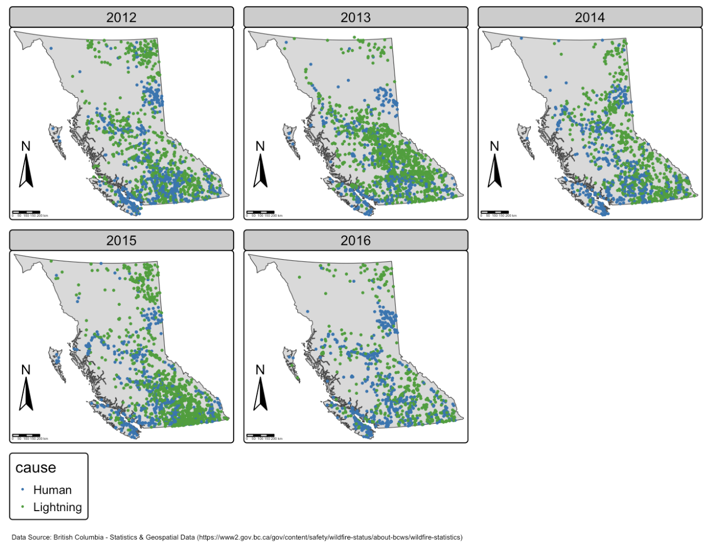

# Wildfire Analysis in British Columbia (Geospatial Data in R)

## Overview

This project analyzes wildfire activity in British Columbia (B.C.) from 2012 to 2024 using geospatial data.

The analysis focuses on understanding how wildfire **size, frequency, distribution, and causes** have changed over time. The main output is a Quarto (`.qmd`) report that documents data processing, visualization, and interpretation.

---

## Objectives

The analysis aims to answer the following questions:

- How have wildfire size, frequency, and spatial distribution changed over time?  
- How do wildfire causes relate to these patterns?  

In addition, the project evaluates data consistency by comparing multiple data sources and discusses limitations of the analysis.

---

## Methods

This project emphasizes intermediate data science skills in R, including:

### Geospatial Data Processing
- Reading and combining multiple `.kml/.kmz` files into a unified `sf` object  
- Working with spatial geometries and coordinate systems  

---

### Hierarchical Data Extraction
- Parsing nested HTML-like structures within dataset fields  
- Extracting structured variables using:
  - `xml2`  
  - `rvest`  
- Automating extraction using custom functions  

---

### Web Scraping & Data Validation
- Collecting external wildfire data via web scraping  
- Comparing datasets using:
  - summary statistics  
  - spatial visualization  
- Assessing consistency across sources  

---

### Data Visualization
- Creating spatial and temporal visualizations using:
  - `tmap`  
  - `leaflet`  
- Visualizing wildfire trends over time and space  
- Designing clear and interpretable map-based outputs  

---

### Analytical Reasoning
- Interpreting changes in wildfire patterns  
- Relating wildfire causes to observed trends  
- Discussing dataset-specific limitations and uncertainties  

---

## Structure

- `wildfire-bc-canada.qmd` — Main report (Quarto document)  
- `wildfire-bc-canada.pdf` — Rendered report with visualizations  

The report includes:
1. Data ingestion and preprocessing  
2. Feature extraction from hierarchical data  
3. Data validation via external sources  
4. Visualization and analysis  

---

## Data

This project uses publicly available wildfire data provided by the British Columbia government.

### Primary Dataset
- B.C. Wildfire Service historical wildfire records (2012–2024)
- Available as KMZ/KML files containing wildfire locations and associated metadata

### Validation Dataset
- Additional wildfire statistics collected through web scraping and used for data validation and consistency checks.

Data source:

- [BC Wildfire Statistics and Historical Data](https://www2.gov.bc.ca/gov/content/safety/wildfire-status/about-bcws/wildfire-statistics?utm_source=chatgpt.com)

The raw datasets are not stored in this repository. The report documents the workflow used to obtain, process, and analyze the data.

---

## Key Takeaways

- Geospatial datasets often require substantial preprocessing before analysis.
- Hierarchical data structures can be transformed into usable tabular formats through automated parsing.
- Cross-validation using independent data sources improves confidence in analytical results.
- Spatial and temporal visualizations reveal patterns that are difficult to identify through summary statistics alone.
- Public government datasets provide valuable opportunities for reproducible geospatial analysis.

  

  <em>Figure 1. Distance of the same points from the KMZ files and website table (2012).</em>

  

  <em>Figure 2. Fire size transition in BC over time (2012-2024).</em>

  

  <em>Figure 3. The ratio of cause of wildfire in BC (2012-2016).</em>

  

  <em>Figure 4. Wildfire geographic distribution transition in BC (2012-2024).</em>

---

## Notes

- This project was completed as part of a graduate-level data science course  
- The focus is on methodology, geospatial analysis, and reproducibility  

---